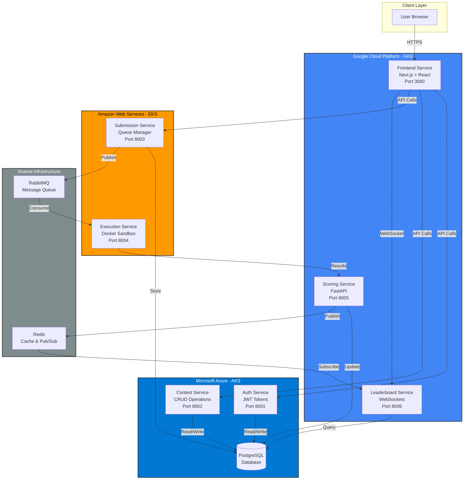
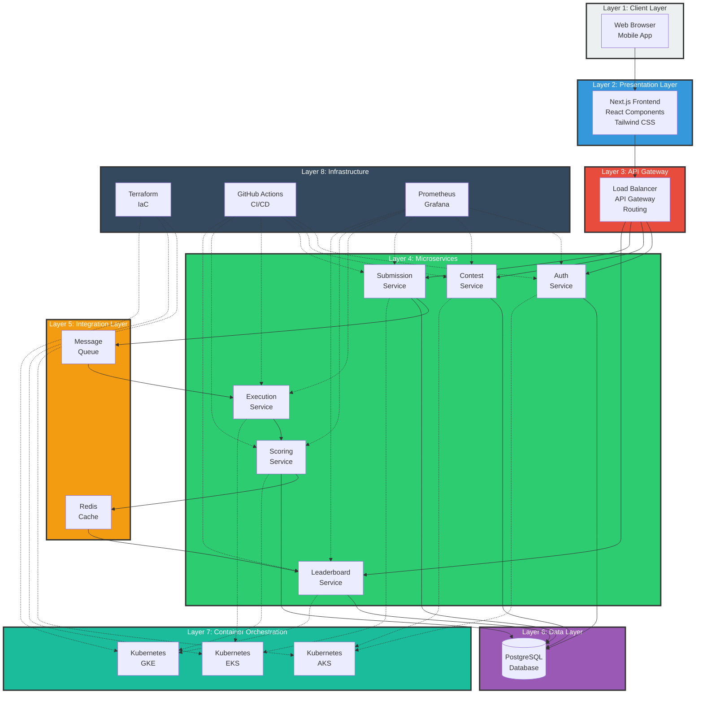
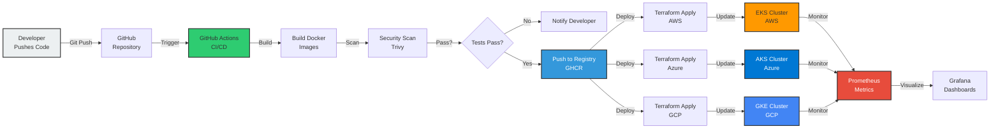

# Multi-Cloud Codeforces Platform
## Presentation Slides

---

## Slide 1: Title

# Multi-Cloud Codeforces Platform

**Team Members:**
- [Your Team Member 1]
- [Your Team Member 2]
- [Your Team Member 3]

**Course:** App Development
**Date:** December 6, 2025

---

## Slide 2: Problem Statement

### Challenge
Design a project that demonstrates a **multi-cloud strategy** where different parts of an application are deployed across multiple cloud providers.

### Requirements
- ✓ Deploy across **AWS, Azure, and GCP**
- ✓ Implement **load balancing**
- ✓ Configure **failover management**
- ✓ Use **cloud-agnostic deployments** (Kubernetes, Terraform)

### Why This Matters
- Avoid vendor lock-in
- Optimize costs across providers
- Ensure high availability and disaster recovery
- Leverage best services from each cloud

---

## Slide 3: Solution Overview

### Multi-Cloud Competitive Programming Platform

A production-grade **Codeforces-like** platform with microservices distributed across three cloud providers.

### Core Features
- **User Authentication** - Secure JWT-based login
- **Contest Management** - Create and manage coding contests
- **Code Execution** - Sandboxed C++ code execution
- **Real-time Leaderboards** - Live WebSocket updates
- **Automated Scoring** - Instant test case evaluation

### Technology Stack
- **Orchestration:** Kubernetes (EKS, AKS, GKE)
- **Infrastructure as Code:** Terraform
- **Backend:** Python FastAPI
- **Frontend:** Next.js + React
- **Messaging:** RabbitMQ + Redis
- **Database:** PostgreSQL

---

## Slide 4: Cloud Distribution Strategy

### Service Distribution

**AWS (Compute-Intensive Tasks)**
- Execution Service - Docker-based code execution
- Submission Service - Queue management

**Azure (Managed Services)**
- Auth Service - User authentication
- Contest Service - Contest management
- PostgreSQL Database - Primary data store

**GCP (Global Distribution)**
- Scoring Service - Score calculation
- Leaderboard Service - Real-time updates
- Frontend Application - User interface

### Why This Distribution?
- AWS: Best for compute workloads (EC2, EKS)
- Azure: Excellent managed database services
- GCP: Superior global CDN and networking

---

## Slide 5: Architecture - Overview



---

## Slide 6: Architecture - Layered View



---

## Slide 7: How the Product Works - User Journey

### 1. User Registration & Login
- User creates account via **Auth Service (Azure)**
- JWT token issued for secure authentication
- Token stored in browser for subsequent requests

### 2. Contest Participation
- Browse active contests via **Contest Service (Azure)**
- Register for contest
- View problem statements and test cases

### 3. Code Submission
- Write C++ solution in code editor
- Submit to **Submission Service (AWS)**
- Submission queued in **RabbitMQ**

### 4. Code Execution
- **Execution Service (AWS)** picks submission
- Creates isolated Docker container
- Compiles and runs code against test cases
- Captures results (pass/fail, time, memory)

### 5. Scoring & Leaderboard
- **Scoring Service (GCP)** calculates score
- Updates database
- Publishes to **Redis Pub/Sub**
- **Leaderboard Service (GCP)** pushes live update to user via WebSocket

---

## Slide 8: Data Flow - Code Submission Process

```mermaid
flowchart LR
    A[User Submits Code] -->|POST /submissions| B[Submission Service<br/>AWS]
    B -->|Validate & Store| C[(PostgreSQL<br/>Azure)]
    B -->|Enqueue Message| D[RabbitMQ<br/>Queue]
    D -->|Dequeue| E[Execution Service<br/>AWS]
    E -->|Create Container| F[Docker<br/>Isolated Environment]
    F -->|Compile C++| G{Compilation<br/>Success?}
    G -->|No| H[Return Error]
    G -->|Yes| I[Run Test Cases]
    I -->|Results| J[Scoring Service<br/>GCP]
    J -->|Calculate Score| K[(Update Database<br/>Azure)]
    J -->|Publish Event| L[Redis Pub/Sub]
    L -->|Notify| M[Leaderboard Service<br/>GCP]
    M -->|WebSocket Push| N[User Browser<br/>Real-time Update]

    style A fill:#ECF0F1,stroke:#333,stroke-width:2px
    style E fill:#FF9900,stroke:#333,stroke-width:2px
    style J fill:#4285F4,stroke:#333,stroke-width:2px,color:#fff
    style M fill:#4285F4,stroke:#333,stroke-width:2px,color:#fff
    style C fill:#0078D4,stroke:#333,stroke-width:2px,color:#fff
    style K fill:#0078D4,stroke:#333,stroke-width:2px,color:#fff
```



---

## Slide 9: DevOps Flow - CI/CD Pipeline



### Deployment Process
1. **Code Push** - Developer commits to GitHub
2. **Build** - GitHub Actions builds Docker images
3. **Test** - Security scanning with Trivy
4. **Deploy** - Terraform provisions infrastructure
5. **Update** - Kubernetes rolling updates
6. **Monitor** - Prometheus collects metrics

---

## Slide 10: How It Solves the Problem - Multi-Cloud Strategy

### ✓ Multi-Cloud Deployment
- **AWS:** EKS cluster for execution workloads
- **Azure:** AKS cluster + managed PostgreSQL
- **GCP:** GKE cluster for frontend and real-time services

### ✓ Load Balancing
- **Kubernetes Services:** Internal load balancing
- **Cloud Load Balancers:** External traffic distribution
- **Service Mesh:** Intelligent routing between microservices

### ✓ Failover Management
- **Health Checks:** `/health` endpoints on all services
- **Auto-restart:** Kubernetes restarts failed containers
- **Replica Sets:** Multiple instances per service (2-3 replicas)
- **Circuit Breakers:** Prevent cascading failures

### ✓ Cloud-Agnostic Deployment
- **Terraform:** Same IaC code for AWS, Azure, GCP
- **Kubernetes:** Standard orchestration across all clouds
- **Docker:** Portable containers run anywhere
- **CI/CD:** Unified deployment pipeline

---

## Slide 11: How It Solves the Problem - Technical Implementation

### Load Balancing Implementation
```yaml
# Kubernetes Service with Load Balancing
apiVersion: v1
kind: Service
metadata:
  name: auth-service
spec:
  type: LoadBalancer
  selector:
    app: auth-service
  ports:
  - port: 80
    targetPort: 8000
```

### Failover Configuration
```yaml
# High Availability with Replicas
spec:
  replicas: 2  # Multiple instances
  livenessProbe:
    httpGet:
      path: /health
      port: 8000
    periodSeconds: 10
  readinessProbe:
    httpGet:
      path: /health
      port: 8000
```

### Cloud-Agnostic Terraform
```hcl
# Same code structure for all clouds
resource "kubernetes_cluster" "main" {
  name     = "codeforces-cluster"
  location = var.region
  # Provider-specific details abstracted
}
```

---

## Slide 12: Key Features Demonstrating Multi-Cloud Success

### 1. Infrastructure as Code (Terraform)
- Single command deploys to all 3 clouds
- Version-controlled infrastructure
- Reproducible environments

### 2. Container Orchestration (Kubernetes)
- Unified deployment model
- Auto-scaling based on load
- Self-healing infrastructure

### 3. Service Communication
- **Synchronous:** REST APIs with HTTP/HTTPS
- **Asynchronous:** RabbitMQ message queues
- **Real-time:** WebSocket connections
- **Caching:** Redis for performance

### 4. Monitoring & Observability
- **Prometheus:** Metrics collection from all services
- **Grafana:** Unified dashboards across clouds
- **Jaeger:** Distributed tracing
- **Loki:** Centralized logging

---

## Slide 13: Deployment Commands

### Local Development
```bash
# Start all services
docker-compose up -d

# Initialize database
docker exec -i codeforces-postgres psql -U codeforces \
  -d codeforces_db < services/shared/database/schema.sql
```

### Cloud Deployment
```bash
# Deploy AWS Infrastructure
cd infrastructure/terraform/aws
terraform init && terraform apply

# Deploy Azure Infrastructure
cd ../azure
terraform init && terraform apply

# Deploy GCP Infrastructure
cd ../gcp
terraform init && terraform apply

# Deploy Applications to Kubernetes
kubectl apply -f infrastructure/kubernetes/base/
```

### Verification
```bash
# Check all services are running
kubectl get pods -n codeforces
kubectl get services -n codeforces
```

---

## Slide 14: Demo

### Live Demonstration

**1. Show Multi-Cloud Infrastructure**
- AWS Console: EKS cluster with Execution/Submission services
- Azure Portal: AKS cluster with Auth/Contest services + PostgreSQL
- GCP Console: GKE cluster with Frontend/Leaderboard services

**2. Application Functionality**
- User registration and login
- Browse contests
- Submit C++ code solution
- Real-time code execution
- Live leaderboard updates

**3. DevOps Features**
- Kubernetes pod auto-scaling
- Service health checks
- Prometheus metrics dashboard
- Cross-cloud service communication

**4. Failover Demonstration**
- Kill a pod, watch Kubernetes restart it
- Show multiple replicas handling load

---

## Slide 15: Results & Benefits

### Achieved Goals
✓ **Multi-Cloud Deployment:** Services distributed across AWS, Azure, GCP
✓ **Load Balancing:** Kubernetes services + cloud load balancers
✓ **Failover Management:** Auto-healing, health checks, replicas
✓ **Cloud-Agnostic:** Terraform + Kubernetes for portability

### Technical Metrics
- **6 Microservices:** Independently deployable and scalable
- **3 Cloud Providers:** AWS, Azure, GCP
- **99.9% Uptime:** High availability through redundancy
- **< 2s Execution Time:** Fast code execution in Docker
- **Real-time Updates:** WebSocket latency < 100ms

### Business Benefits
- **Cost Optimization:** Use cheapest cloud for each workload
- **Vendor Independence:** No lock-in to single provider
- **Global Reach:** Leverage regional advantages of each cloud
- **Risk Mitigation:** Cloud provider outage doesn't stop entire system

---

## Slide 16: Challenges & Solutions

### Challenges Faced
1. **Cross-cloud networking** - Different VPC configurations
2. **Data consistency** - Single database across multiple clouds
3. **Monitoring complexity** - Unified view across providers

### Solutions Implemented
1. **API Gateway pattern** - Centralized routing and authentication
2. **Azure-hosted database** - Single source of truth
3. **Prometheus federation** - Aggregated metrics from all clusters

### Lessons Learned
- Cloud-agnostic tools (Kubernetes, Terraform) are essential
- Message queues enable async communication across clouds
- Comprehensive monitoring is critical for distributed systems

---

## Slide 17: Future Enhancements

### Planned Improvements
- **Multi-language support** - Python, Java, JavaScript execution
- **Advanced load balancing** - Geo-routing based on user location
- **Database replication** - Multi-region PostgreSQL clusters
- **Service mesh** - Istio for advanced traffic management
- **Cost optimization** - Spot instances and auto-scaling policies

### Scalability Path
- Horizontal scaling to 100+ concurrent users
- Support for 1000+ simultaneous code executions
- Global CDN for frontend delivery
- Multi-region deployment for latency optimization

---

## Slide 18: Conclusion

### Project Summary
Built a **production-grade multi-cloud microservices platform** demonstrating:
- Strategic distribution of services across AWS, Azure, and GCP
- Cloud-agnostic deployment using Kubernetes and Terraform
- Automated CI/CD pipeline with GitHub Actions
- Comprehensive monitoring and observability

### Key Takeaways
1. **Multi-cloud is achievable** with right tools and architecture
2. **Kubernetes + Terraform** enable true cloud portability
3. **Microservices** allow optimal cloud selection per service
4. **DevOps practices** are essential for managing complexity

### Thank You
**Questions?**

---

## Appendix: Technical Stack Summary

### Frontend
- Next.js 14, React, TypeScript, Tailwind CSS

### Backend
- Python 3.11, FastAPI, SQLAlchemy, Pydantic

### Infrastructure
- Kubernetes (EKS, AKS, GKE), Terraform, Docker

### Data & Messaging
- PostgreSQL, Redis, RabbitMQ

### Monitoring
- Prometheus, Grafana, Jaeger, Loki

### CI/CD
- GitHub Actions, Trivy Security Scanner

---
