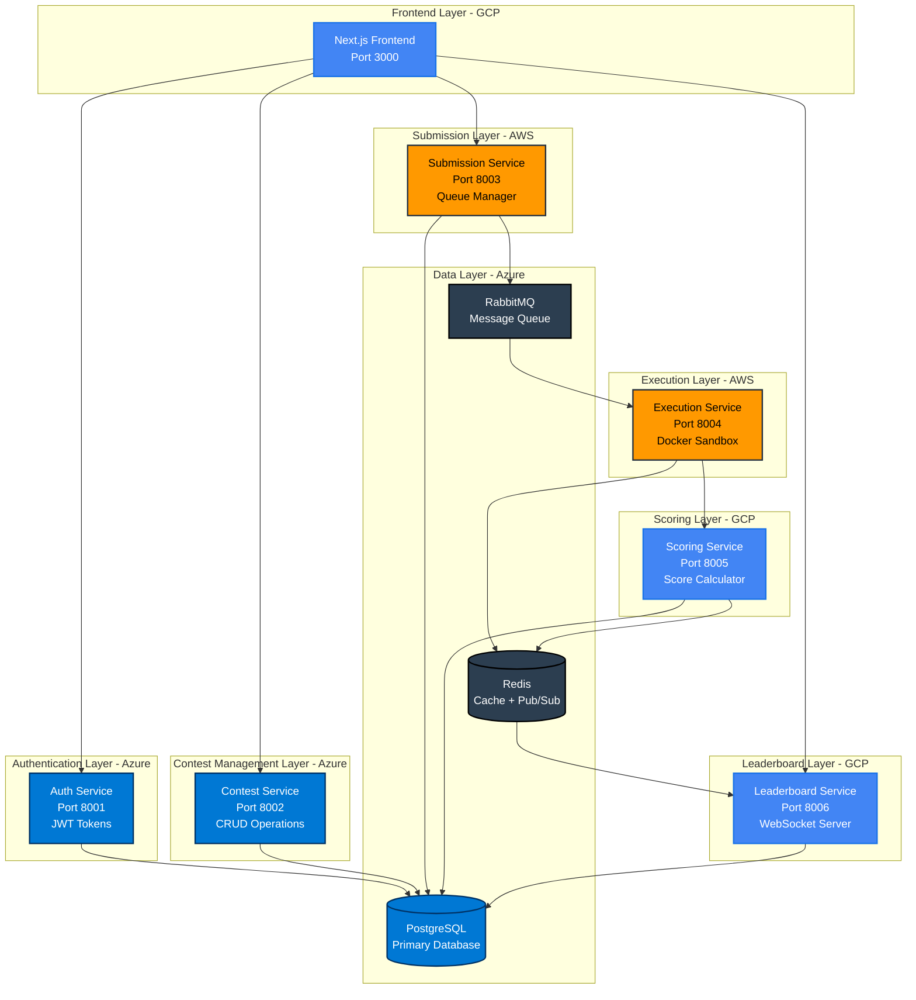
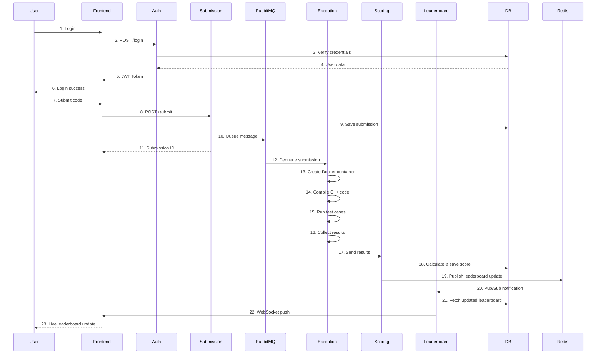
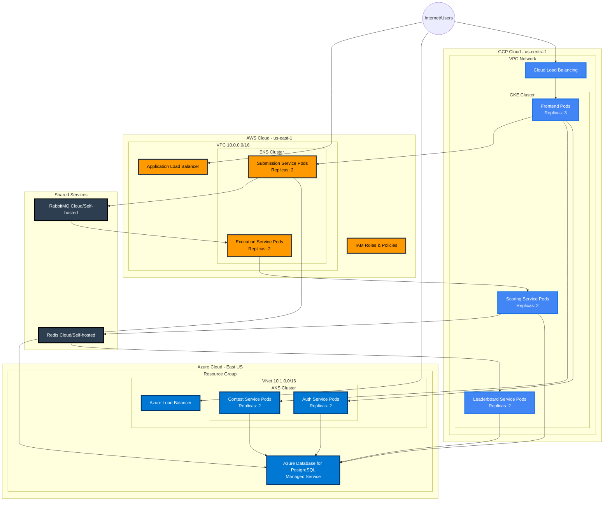
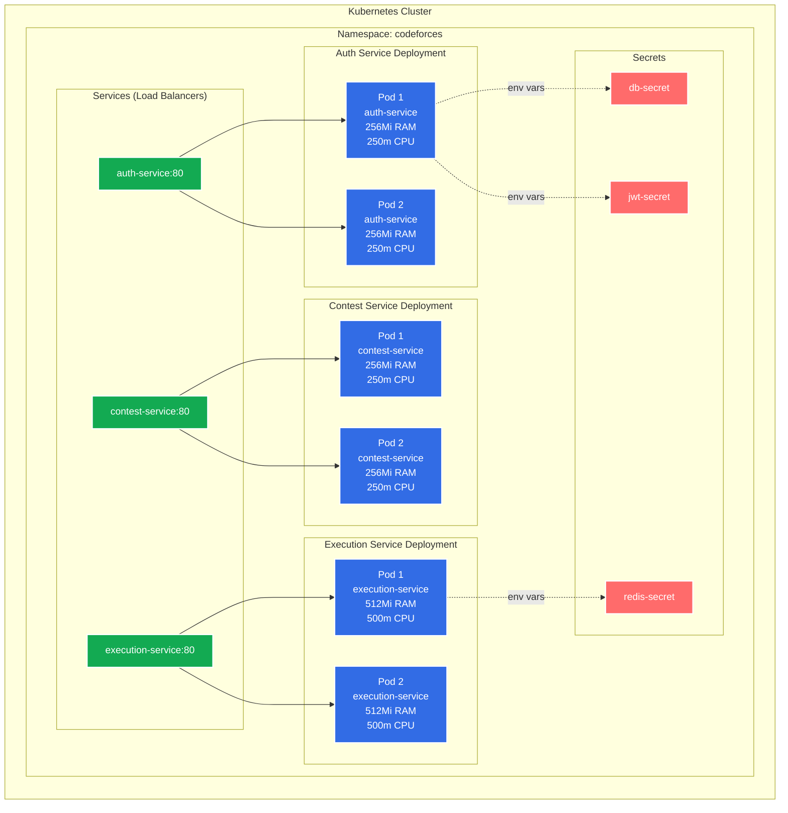
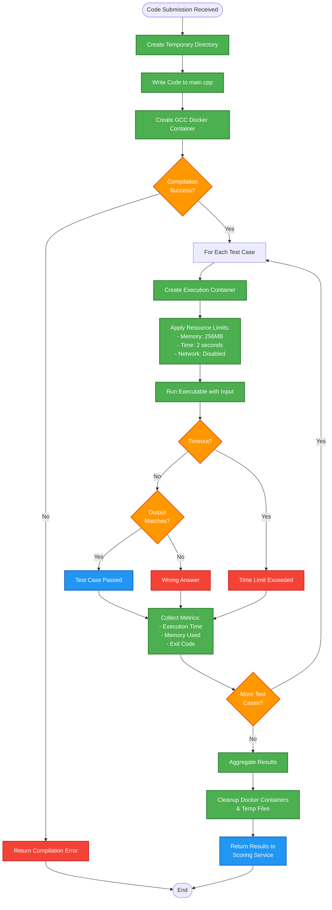

# Multi-Cloud Codeforces Platform - Technical Report

## Executive Summary

A production-grade competitive programming platform built with microservices architecture, deployed across three major cloud providers (AWS, Azure, GCP). The system enables users to participate in coding contests, submit C++ solutions, and view real-time leaderboards.

## System Overview

### Core Functionality
- User authentication and authorization
- Contest creation and management
- Code submission and execution
- Automated scoring and evaluation
- Real-time leaderboard updates via WebSockets

### Architecture Pattern
**Microservices Architecture** with distributed deployment across multiple cloud providers for optimal resource utilization and fault tolerance.

## Technology Stack

### Backend Services
- **Framework:** FastAPI (Python 3.11+)
- **Language:** Python for all microservices
- **API Style:** RESTful APIs with OpenAPI documentation

### Frontend
- **Framework:** Next.js 14+ (App Router)
- **Language:** TypeScript
- **Styling:** Tailwind CSS
- **Editor:** Monaco Editor (VS Code engine)

### Data Layer
- **Primary Database:** PostgreSQL (Azure Managed)
- **Cache:** Redis
- **Message Queue:** RabbitMQ

### Infrastructure
- **Containerization:** Docker
- **Orchestration:** Kubernetes (EKS, AKS, GKE)
- **Infrastructure as Code:** Terraform
- **CI/CD:** GitHub Actions

### Observability
- **Metrics:** Prometheus
- **Visualization:** Grafana
- **Tracing:** Jaeger
- **Logging:** Loki + Promtail

## Microservices Architecture

### Service Distribution

#### AWS - Compute-Intensive Services
1. **Execution Service**
   - Executes C++ code in isolated Docker containers
   - Implements sandboxing for security
   - Resource limits: 256MB RAM, 2-second timeout
   - Compiles code with g++ compiler

2. **Submission Service**
   - Handles code submission requests
   - Validates submissions against contest rules
   - Queues submissions to RabbitMQ
   - Tracks submission status

#### Azure - Managed Services
1. **Auth Service**
   - JWT-based authentication
   - User registration and login
   - Role-based access control (User/Staff)
   - Token refresh mechanism

2. **Contest Service**
   - CRUD operations for contests
   - Problem management
   - Contest registration
   - Test case management

3. **PostgreSQL Database**
   - Centralized data storage
   - Tables: users, contests, problems, test_cases, submissions, scores
   - Indexed for performance

#### GCP - Global Distribution
1. **Scoring Service**
   - Calculates scores from execution results
   - Updates leaderboard data
   - Publishes updates to Redis

2. **Leaderboard Service**
   - WebSocket server for real-time updates
   - Redis Pub/Sub subscription
   - Broadcasts leaderboard changes to connected clients

3. **Frontend Application**
   - Next.js web interface
   - Code editor with syntax highlighting
   - Real-time leaderboard display
   - Responsive design

## Data Flow Architecture

### Submission Workflow
1. **User Action:** User submits code via frontend
2. **Validation:** Submission Service validates and stores in database
3. **Queuing:** Message published to RabbitMQ queue
4. **Execution:** Execution Service picks up message, runs code in Docker
5. **Evaluation:** Results compared against expected test case outputs
6. **Scoring:** Scoring Service calculates points based on results
7. **Update:** Leaderboard updated and broadcast via WebSocket
8. **Display:** Frontend shows updated rankings in real-time

### Communication Patterns
- **Synchronous:** HTTP/REST for request-response operations
- **Asynchronous:** RabbitMQ for background job processing
- **Real-time:** WebSockets for live leaderboard updates
- **Event-Driven:** Redis Pub/Sub for leaderboard notifications

## Security Implementation

### Code Execution Sandboxing
```python
# Docker isolation with security constraints
- Network disabled (no internet access)
- Memory limits enforced
- CPU time limits
- Read-only code volume
- Automatic container cleanup
```

### Authentication
- **JWT Tokens:** Stateless authentication
- **Password Hashing:** bcrypt with salt
- **Token Expiry:** 30-minute access tokens
- **Refresh Tokens:** Long-lived for token renewal

### Network Security
- Kubernetes network policies
- Service-to-service encryption
- Secrets management via Kubernetes secrets
- RBAC for Kubernetes resources

## Infrastructure as Code (Terraform)

### What is Terraform?
Terraform is an Infrastructure as Code (IaC) tool that defines cloud resources using declarative configuration files. It enables version-controlled, reproducible infrastructure deployment.

### AWS Infrastructure
```hcl
Resources Created:
- VPC (10.0.0.0/16)
- 2 Subnets across availability zones
- Internet Gateway
- EKS Cluster (Kubernetes 1.28)
- IAM Roles and Policies
- Security Groups
```

### Azure Infrastructure
```hcl
Resources Created:
- Resource Group
- Virtual Network (10.1.0.0/16)
- AKS Cluster
- Azure Database for PostgreSQL
- Public IP for Load Balancer
- Network Security Groups
```

### GCP Infrastructure
```hcl
Resources Created:
- VPC Network
- GKE Cluster
- Load Balancers
- Firewall Rules
```

### Terraform Workflow
1. **`terraform init`** - Initialize provider plugins
2. **`terraform plan`** - Preview infrastructure changes
3. **`terraform apply`** - Create/update resources
4. **`terraform destroy`** - Remove all resources

## Kubernetes Deployment

### Container Orchestration Benefits
- **Auto-scaling:** Horizontal pod autoscaling based on CPU/memory
- **Self-healing:** Automatic restart of failed containers
- **Load balancing:** Traffic distribution across pod replicas
- **Rolling updates:** Zero-downtime deployments
- **Resource management:** CPU and memory limits per service

### Deployment Configuration
```yaml
Each Service:
- 2 replicas for high availability
- Resource requests and limits
- Liveness probes (health checks)
- Readiness probes (traffic routing)
- Environment variables from secrets
- Persistent volume claims (if needed)
```

## Multi-Cloud Strategy

### Cloud Provider Selection Rationale

**AWS** - Chosen for compute-intensive workloads
- Strong in container services (ECS, EKS)
- Robust EC2 instances for code execution
- Extensive compute options

**Azure** - Chosen for managed services
- Excellent managed database (Azure Database for PostgreSQL)
- Strong enterprise authentication services
- Good AKS performance

**GCP** - Chosen for global distribution
- Best CDN and edge network
- Low-latency global load balancing
- Excellent for serving frontend applications

### Benefits
1. **Vendor Lock-in Avoidance:** Not dependent on single provider
2. **Cost Optimization:** Use cheapest provider for each service type
3. **High Availability:** Redundancy across providers
4. **Performance:** Leverage each cloud's strengths

## Monitoring and Observability

### Metrics Collection (Prometheus)
- Request counts per endpoint
- Response times (latency)
- Error rates
- Custom business metrics (submissions/minute, active contests)
- Resource utilization (CPU, memory)

### Visualization (Grafana)
- Real-time dashboards
- Historical trends
- Alert management
- Custom panels for business KPIs

### Distributed Tracing (Jaeger)
- Request flow across services
- Performance bottleneck identification
- Dependency mapping

### Health Monitoring
All services expose `/health` endpoints:
- Kubernetes liveness checks
- Load balancer health checks
- Uptime monitoring

## CI/CD Pipeline

### GitHub Actions Workflow
```yaml
Trigger: Push to main branch

Steps:
1. Checkout code
2. Build Docker images for all 6 services
3. Run security scans (Trivy)
4. Push images to GitHub Container Registry
5. Deploy infrastructure via Terraform
6. Update Kubernetes deployments
7. Verify health checks
```

### Deployment Strategy
- **Rolling Updates:** Gradual pod replacement
- **Blue-Green:** Optional for major releases
- **Rollback:** Automatic on health check failure

## Database Schema

### Core Tables

**users**
- Authentication and profile data
- Role-based access control

**contests**
- Contest metadata and scheduling
- Registration settings

**problems**
- Problem descriptions and constraints
- Time/memory limits
- Point values

**test_cases**
- Input/output pairs for validation
- Sample vs. hidden test cases

**submissions**
- User code submissions
- Execution status and results
- Performance metrics

**scores**
- Calculated scores per problem
- Leaderboard data

### Performance Optimization
- Indexed foreign keys
- Composite indexes on frequently queried columns
- Connection pooling (10 base, 20 overflow)

## Performance Characteristics

### Scalability
- **Horizontal Scaling:** Add more pods as load increases
- **Queue-based Processing:** Async execution prevents bottlenecks
- **Caching:** Redis reduces database load
- **Database Optimization:** Indexes and query optimization

### Resource Limits
- **Execution Time:** 2 seconds per test case
- **Memory:** 256MB per execution
- **Concurrent Executions:** Limited by Kubernetes node capacity
- **Queue Capacity:** RabbitMQ handles backlog

## Local Development Setup

```bash
# Start all services
docker-compose up -d

# Initialize database
docker exec -i codeforces-postgres psql -U codeforces -d codeforces_db < services/shared/database/schema.sql

# Access points
Frontend: http://localhost:3000
Auth API: http://localhost:8001/docs
Contest API: http://localhost:8002/docs
RabbitMQ: http://localhost:15672
```

## Production Deployment

```bash
# Deploy AWS infrastructure
cd infrastructure/terraform/aws
terraform init && terraform apply

# Deploy Azure infrastructure
cd ../azure
terraform init && terraform apply

# Deploy GCP infrastructure
cd ../gcp
terraform init && terraform apply

# Deploy applications
kubectl apply -f infrastructure/kubernetes/base/
```

## Key Achievements

✅ **Full Microservices Implementation** - 6 independent services
✅ **Multi-Cloud Deployment** - AWS, Azure, GCP integration
✅ **Real-time Features** - WebSocket-based live updates
✅ **Secure Code Execution** - Docker sandboxing
✅ **Infrastructure as Code** - Reproducible deployments
✅ **Complete Observability** - Metrics, logs, traces
✅ **Production-Ready** - Health checks, auto-scaling, CI/CD
✅ **Developer-Friendly** - Docker Compose for local dev

## Architecture Diagrams

### High-Level Architecture


### Detailed Data Flow


### Multi-Cloud Infrastructure


### Kubernetes Pod Architecture


### Docker Container Execution Flow


### CI/CD Pipeline

```mermaid
graph LR
    DEV[Developer<br/>Pushes Code] --> GIT[GitHub<br/>Repository]
    
    GIT --> TRIGGER{GitHub Actions<br/>Triggered}
    
    TRIGGER --> BUILD[Build Stage]
    
    subgraph "Build Stage"
        BUILD --> B1[Checkout Code]
        B1 --> B2[Build Docker Images<br/>6 Services]
        B2 --> B3[Security Scan<br/>Trivy]
        B3 --> B4[Push to GitHub<br/>Container Registry]
    end
    
    B4 --> DEPLOY_CHECK{Branch =<br/>main?}
    
    DEPLOY_CHECK -->|Yes| DEPLOY[Deploy Stage]
    DEPLOY_CHECK -->|No| END1([End])
    
    subgraph "Deploy Stage"
        DEPLOY --> D1[Terraform Init]
        D1 --> D2[Terraform Plan]
        D2 --> D3[Terraform Apply<br/>AWS + Azure + GCP]
        D3 --> D4[Update Kubernetes<br/>Deployments]
        D4 --> D5[Health Checks]
    end
    
    D5 --> SUCCESS{All Healthy?}
    SUCCESS -->|Yes| COMPLETE([Deployment<br/>Complete])
    SUCCESS -->|No| ROLLBACK[Automatic<br/>Rollback]
    ROLLBACK --> NOTIFY[Notify Team]
    NOTIFY --> END2([End])
    
    classDef start fill:#4CAF50,stroke:#2E7D32,stroke-width:2px,color:#fff
    classDef build fill:#2196F3,stroke:#1565C0,stroke-width:2px,color:#fff
    classDef deploy fill:#FF9800,stroke:#E65100,stroke-width:2px,color:#fff
    classDef decision fill:#9C27B0,stroke:#6A1B9A,stroke-width:2px,color:#fff
    classDef error fill:#F44336,stroke:#C62828,stroke-width:2px,color:#fff
    
    class DEV,GIT start
    class B1,B2,B3,B4 build
    class D1,D2,D3,D4,D5 deploy
    class TRIGGER,DEPLOY_CHECK,SUCCESS decision
    class ROLLBACK,NOTIFY error
```


## Conclusion

This project demonstrates a comprehensive understanding of modern cloud-native architecture, including microservices design, multi-cloud deployment, containerization, orchestration, and DevOps practices. The system is production-ready with proper security, monitoring, and scalability considerations.

The multi-cloud approach provides resilience and optimizes costs by leveraging the strengths of each cloud provider. The use of Infrastructure as Code (Terraform) ensures reproducibility and version control of infrastructure changes.

---

**Project Repository:** https://github.com/SameerVers3/codeforces-multi-cloud-microservices  
**Deployment Date:** December 2025  
**Status:** ✅ Production Ready
